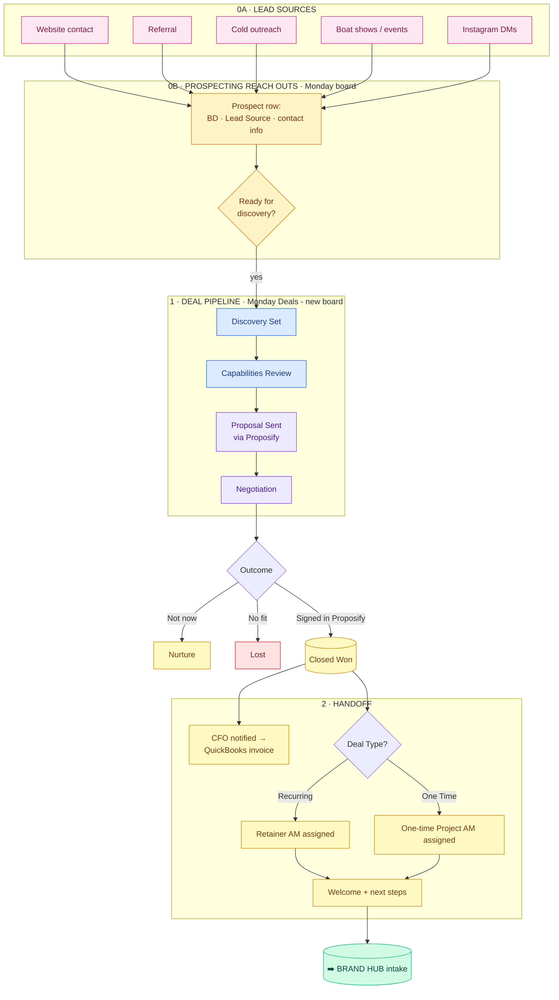
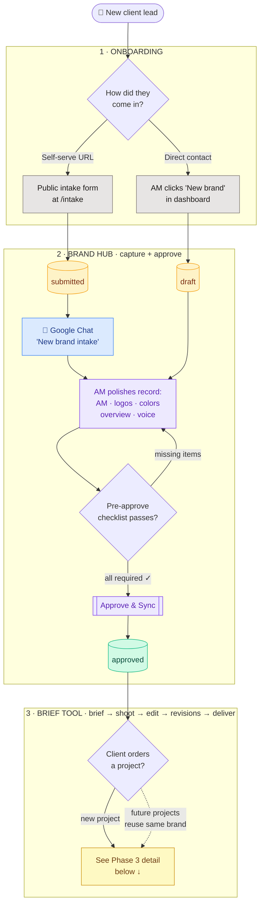

# SG client lifecycle — Sales → Brand Hub → Brief Tool

This is the end-to-end flow a client travels through, from first lead to
shipped deliverable. Four phases:

- **Phase 0 — Sales** (Monday: Prospecting Reach Outs + Deals - new boards)
- **Phase 1 — Onboarding** (Brand Hub intake)
- **Phase 2 — Brand identity** (Brand Hub editor + Approve & Sync)
- **Phase 3 — Per-project briefs** (Brief Tool, looped for each project)

Brand Hub owns brand identity (one-time setup per client). Brief Tool owns
per-project briefs (many per client, each spawning a shoot → edit → revision
→ deliver loop).

Detailed diagrams: [sales-flow.png](./sales-flow.png) ·
[workflow.png](./workflow.png) · [brief-flow.png](./brief-flow.png)

---

## Phase 0 — Sales pipeline (prospect → close)

Owned by Phallon (BD) with assists from anyone on the team — the deal
identifier is tracked separately from the BD/AE so the originator always
gets credit even when Phallon runs the close.

### What's in the Deals board today

Pipeline stages (`Stage` column): **Discovery Set → Capabilities Review → Proposal Sent → Negotiation**

Group buckets (the rows move between groups as outcomes land): **Active Deals · Nurture · Lost · Closed Won**

Each deal carries:
- **BD / AE** — Phallon owns most, but Stephen, Billy, Arial, Austin also work deals
- **Deal Identifier** — separate column, tracks credit for whoever brought in the lead even if Phallon runs the close
- **Deal Value $** + **Close Probability %** + **Close Date** for forecasting
- **Deal Rank** — Tier 1 (High Urgency) → Tier 4 (Cold / Stalled)
- **Deal Type** — One Time vs. Recurring (this is what determines retainer vs. one-off AM assignment downstream)
- **Lead Source** — Network · Call In · Returning · Email · etc.
- **Primary Contact + Billing Contact** — board-relation links to Contacts - new
- **Proposal Section + Template + Proposal Creation** status columns — workflow around the Proposify document
- Linked **subitems** track multi-step deal work

### The close → kickoff handoff (manual today)

1. Proposify document signed → BD updates deal to Closed Won group
2. BD pings AM Head to assign an AM
   - **Recurring** → Retainer AM
   - **One Time** → One-time Project AM
3. CFO is notified out of band → sends invoice via QuickBooks
4. BD/AM sends welcome + next-steps package to client
5. Kickoff call scheduled
6. **Brand Hub intake** kicks off (Phase 1 below)

### Manual gaps in the sales side

| Letter | Gap | Why it costs time |
|---|---|---|
| **S1** | Lead source de-dup | A prospect can come in from referral *and* IG DM; merging records is manual |
| **S2** | Prospect → Deal lift | Moving from Prospecting Reach Outs to Deals - new is a manual "Move to Deal" status click |
| **S3** | Proposify document tracking | Proposal Section / Template / Creation status columns are typed by hand, not synced from Proposify |
| **S4** | Closed Won → AM Head | BD has to remember to ping AM Head + flag Deal Type for routing |
| **S5** | Closed Won → CFO | Invoice trigger is manual notification, not a webhook |
| **S6** | Closed Won → Brand Hub | Nobody auto-creates the brand draft from the deal — AM starts intake from scratch |
| **S7** | Credit attribution | Deal Identifier captures who brought the lead, but commission/credit math happens offline |

---

---

## Overview — three phases

---

## Phase 3 detail — Brief Tool flow

Tool-owned steps numbered 1–7. Manual gaps (the parts that happen in email /
Slack / Monday / someone's head) lettered A–E and flagged as automation
candidates.

```mermaid
flowchart TB
    classDef tool fill:#fef9c3,stroke:#ca8a04,color:#713f12
    classDef gap fill:#fee2e2,stroke:#dc2626,color:#7f1d1d,stroke-dasharray: 6 4
    classDef external fill:#e7e5e4,stroke:#78716c,color:#1c1917
    classDef brand fill:#ede9fe,stroke:#7c3aed,color:#5b21b6

    Hub[(Brand Hub<br/>brand_directory view)]
    GapA[A · Intake<br/>info pulled from<br/>client email · Monday<br/>request · sales call<br/>manually retyped]

    Hub --> Create
    GapA --> Create

    Create[1 · Create Brief<br/>· Project Overview<br/>· Mission & Opportunity<br/>· Deliverables: video/photo/<br/>  graphic/micro-content<br/>· Brand Notes auto-pulled<br/>· Attachments 50 MB cap<br/>· Logistics notes]

    Create --> GapB

    GapB[B · Creator assignment<br/>free-text typed<br/>each time]

    GapB --> Monday

    Monday[2 · Project Request → Monday<br/>· Monday item created<br/>· One sub-item per deliverable<br/>· Each carries Task Type<br/>· Link back to brief]

    Monday --> GapC

    GapC[C · Scheduling<br/>email ping-pong to<br/>lock shoot date]

    GapC --> Cal

    Cal[3 · Calendar Invite → Google Calendar<br/>· Shoot event created<br/>· Attendees auto-resolved<br/>  creators + AM + client POC]

    Cal --> Share

    Share[4 · Share Link → Creator<br/>Public brief URL<br/>no login required]

    Share --> Shoot[🎬 Shoot day]

    Shoot --> Direction[Creator adds post-shoot:<br/>· Dropbox raw-files link<br/>· Editing direction<br/>· Music direction<br/>· Per-deliverable creator notes<br/>rich-text formatting]

    Direction --> Submit[5 · Submit Direction<br/>· Flips Monday sub-item to<br/>  'Ready to Edit'<br/>· Project Coordinator notified]

    Submit --> Edit[✂️ Editor works the deliverable]

    Edit --> Webhook[6 · Webhook<br/>Monday status changes<br/>auto-return/advance the item]

    Webhook --> ReviewQ{Edit ready?}

    ReviewQ -->|Revision needed| Rev
    ReviewQ -->|Approved internally| GapD

    Rev[7 · Revision request<br/>· New Monday sub-item<br/>· Move group<br/>· Notify owner<br/>· Deliverable link + attachment]

    Rev --> Edit

    GapD[D · Final delivery to client<br/>+ client approval / sign-off<br/>NOT IN TOOL TODAY]

    GapD --> GapE

    GapE[E · Status visibility<br/>spread across Monday +<br/>tool + email — no single<br/>'where does everything stand']

    class Hub brand
    class Create,Monday,Cal,Share,Direction,Submit,Webhook,Rev tool
    class GapA,GapB,GapC,GapD,GapE gap
    class Shoot,Edit external
```

---

## What's automated vs what's still manual

### 🟨 Tool-owned (1–7)

| # | Step | What happens |
|---|---|---|
| 1 | Create Brief | Rich-text brief editor — Project Overview, Mission & Opportunity, deliverables, Brand Notes, attachments, logistics |
| 2 | Project Request → Monday | Monday item + one sub-item per deliverable, Task Type + brief backlink |
| 3 | Calendar Invite → Google Calendar | Shoot event with creators + AM + client POC auto-resolved |
| 4 | Share Link → Creator | Creator opens public brief link, no login |
| 5 | Submit Direction | Creator's post-shoot direction flips Monday sub-item to "Ready to Edit", notifies PC |
| 6 | Webhook | Monday status changes auto-propagate back into the tool |
| 7 | Revisions | New sub-item, group move, owner notified, attachment supported |

### 🟥 Manual gaps (A–E) — automation candidates

| Letter | Gap | Biggest pain | Automation opportunity |
|---|---|---|---|
| **A** | **Intake** before step 1 | Brief info retyped from email / Monday / sales call — biggest manual tax | Auto-create draft brief from an email subject, a Monday item, or a Brand Hub "Create brief for this client" button |
| **B** | **Creator assignment** | Free-text field — typing names each time | Team-directory dropdown with recent-assignments memoization, or auto-suggest from brand history |
| **C** | **Scheduling** | Email ping-pong to lock shoot date before Step 3 fires | Embedded Calendly-style availability picker, or Google Calendar find-a-time before the invite goes out |
| **D** | **Final delivery + approval** | Finished deliverables reach the client outside the tool, sign-off lives in email | Built-in "review & approve" page (Frame.io-style) with comments, versioned previews, and an explicit approval button that flips status |
| **E** | **Status visibility** | "Where does everything stand?" lives partly in Monday, partly in the tool, partly in someone's head | Unified dashboard view (across briefs + Monday + Brand Hub) — one place to see every active project's stage |

---

## The handoffs

| From → To | What flows | How |
|---|---|---|
| Public form → Brand Hub | Initial brand info | `POST /api/intake` creates brand row at `status='submitted'` |
| Brand Hub → Team | "New brand needs review" | Google Chat card on submission |
| Brand Hub → Dropbox | Folder tree | Dropbox SDK on approve |
| Brand Hub → Monday | Brand info + parent item | Monday GraphQL on approve |
| Brand Hub → Brief Tool | Brand identity for briefs | `public.brand_directory` view (read-only contract) |
| Brand Hub ↔ Brief Tool | AM / contact info | Two-way DB trigger keeps canonical ↔ duplicate columns in sync |
| Brief Tool → Monday | Project request + per-deliverable sub-items | GraphQL writes on brief creation |
| Brief Tool → Google Calendar | Shoot event + attendees | Google Calendar API |
| Brief Tool → Creator | Brief specifics + direction request | Public brief share URL |
| Brief Tool ↔ Monday | Status changes both directions | Webhook (Monday → tool) + GraphQL (tool → Monday) |
| Creator → Brief Tool | Post-shoot direction + raw files link | Form on the public brief page |
| Creator → Dropbox | Raw files | Manual upload to Dropbox folder created by Brand Hub on approve |

## Why this shape

- **Brand identity is durable** (years, many projects) → Brand Hub.
- **Briefs are per-project** (dozens per year per client) → Brief Tool. Each pulls brand identity fresh, so no copy-paste between systems and no "which version of the brand is right?".
- **Sync trigger** between the two apps keeps contact info / AM in lockstep until Brief Tool fully migrates onto the `brand_directory` view.

## Where to push next (priority)

1. **Gap D — client approval flow.** Biggest workflow gap. Today the tool ends when the editor finishes; client sign-off happens externally. Brings the loop fully in-tool.
2. **Gap A — intake.** Pre-fill briefs from incoming emails / Monday / a Brand Hub button. Eliminates the retype-from-email tax.
3. **Gap E — unified status view.** Cross-system "what's happening right now" dashboard. Solves the "where does it stand" problem permanently.
4. **Gap B — creator dropdown.** Quickest win, smallest scope. Pulls from the same team directory the calendar invite uses.
5. **Gap C — scheduling.** Hardest of the five (calendar integration nuance) but big UX payoff.
