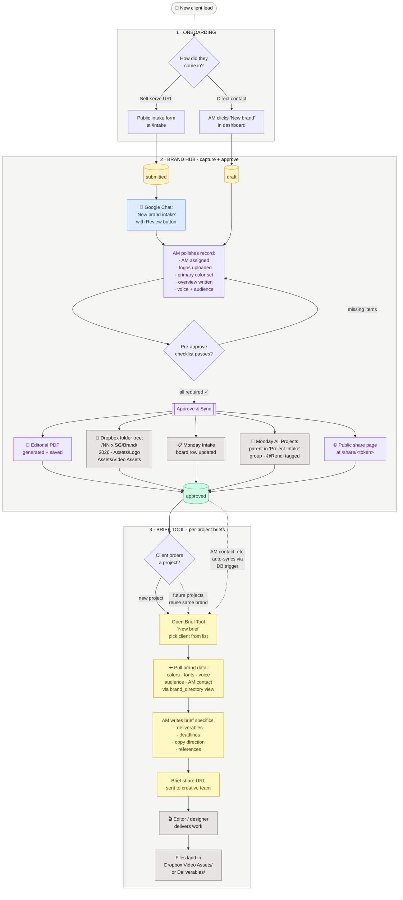

# SG client lifecycle — Brand Hub + Brief Tool

This is the end-to-end flow a client travels through, from first lead to
shipped deliverable. Brand Hub owns brand identity (one-time setup per
client). Brief Tool owns per-project briefs (many per client).

## At a glance

## How to read it

Three phases, color-coded by ownership:

- 🟪 **Brand Hub steps** (purple) — capture, polish, approve. One-time per client.
- 🟨 **Brief Tool steps** (yellow) — per-project briefs that pull brand data. Many per client.
- ⬜️ **External integrations** (gray) — Dropbox, Monday, share page.

## Key handoffs

| From → To | What flows | How |
|---|---|---|
| Public form → Brand Hub | Initial brand info | `POST /api/intake` creates brand row at `status='submitted'` |
| Brand Hub → Team | "New brand needs review" | Google Chat card on submission |
| Brand Hub → Dropbox | Folder tree | Dropbox SDK on approve |
| Brand Hub → Monday | Brand info + parent item | Monday GraphQL API on approve |
| Brand Hub → Brief Tool | Brand identity for briefs | `public.brand_directory` view (read-only contract) |
| Brand Hub ↔ Brief Tool | Contact info / AM | Two-way trigger syncs canonical ↔ duplicate columns |
| Brief Tool → Creative team | Brief specifics | Brief share URL |
| Creative team → Dropbox | Final deliverables | Manual upload to Brand Hub-created folders |

## Why this shape

- **Brand identity is durable** (a brand exists for years across many projects), so it lives in Brand Hub with permanent storage and a stable share URL.
- **Briefs are ephemeral** (one per project, dozens per year per client), so they live in Brief Tool with the brand identity pulled in fresh each time — no copy-paste of colors/fonts/voice between systems.
- **Single source of truth** — when an AM updates the brand's voice description in Brand Hub, the next brief created automatically uses the new voice. No "which version of the brand is right?" confusion.

## Two-way sync (Brand Hub ↔ Brief Tool)

Both apps share one Supabase project. Brief Tool currently reads + writes its
own column names (`am`, `poc_name`, `poc_email`, `poc_num`); Brand Hub uses
canonical names (`account_manager`, `submitter_*`). A DB trigger keeps both
sides in lockstep — editing either app updates the other. Long-term plan is
for Brief Tool to fully migrate onto `brand_directory` and the duplicates to
get dropped, but no rush.
